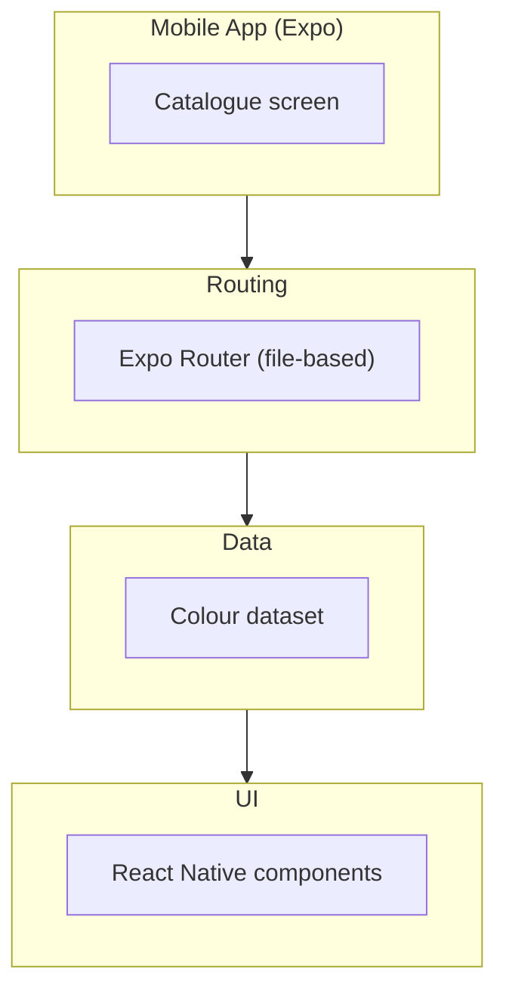
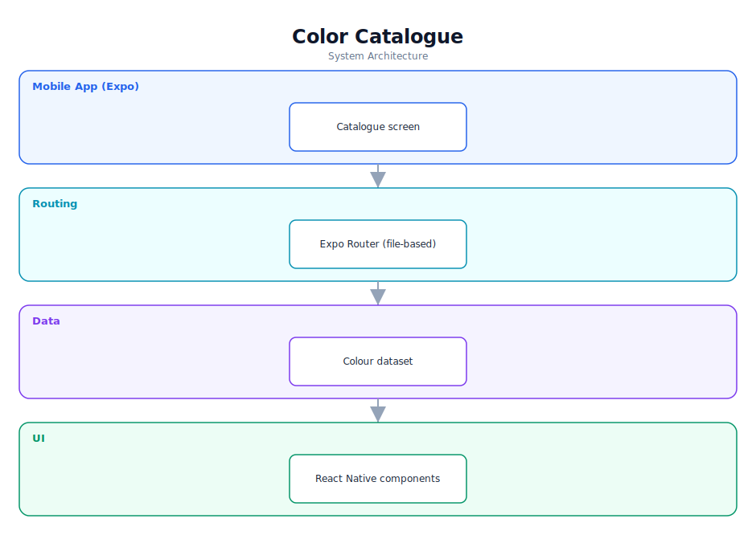

# Color Catalogue — Software Documentation

> A React Native (Expo) app for browsing a catalogue of colours.

**Repository:** [`ColorCatalogue`](https://github.com/Monametsi-s/ColorCatalogue)  
**Type:** Cross-platform mobile application  
**Status:** Learning exercise

---

## 1. Overview

Color Catalogue is a React Native application built with Expo and file-based routing. It presents a catalogue of colours in a mobile UI and serves primarily as a learning exercise in Expo Router and React Native fundamentals.

## 2. System Architecture

The diagram below shows the high-level architecture and how data flows between layers. It renders automatically on GitHub (Mermaid) and is also committed as a vector image ([`architecture.svg`](architecture.svg)).



<p align="center"></p>

### 2.1 Component responsibilities

| Layer | Responsibility |
|---|---|
| **Mobile app** | Displays the colour catalogue. |
| **Routing** | Expo Router file-based navigation. |
| **Data** | A static dataset of colours. |
| **UI** | React Native components for rendering swatches. |

## 3. Technology Stack

| Area | Technology |
|---|---|
| Framework | React Native + Expo |
| Routing | Expo Router |
| Language | TypeScript |

## 4. Assumed User Requirements

_These requirements are inferred from the project's purpose and feature set; they document the intended behaviour rather than a formally agreed specification._

### 4.1 Functional requirements

- **FR-01** — Display a list/grid of colours.
- **FR-02** — Navigate between screens via file-based routing.
- **FR-03** — Show colour details (name/value).

### 4.2 Representative user stories

- As a user, I want to browse a set of colours on my phone.
- As a learner, I want a clean Expo Router example.
- As a user, I want to view details for a colour.

### 4.3 Non-functional requirements

- The app must run on Android and iOS via Expo.
- Navigation should be smooth.
- The UI should be simple and clear.

## 5. Assumed System Requirements

### 5.1 End-user (runtime) requirements

- A physical Android or iOS device, or an emulator/simulator.
- The **Expo Go** app installed (for development builds) or an installed production build.
- Approximately 50–150 MB of free storage for the app and local data.

### 5.2 Server / hosting requirements

- None — this project runs entirely on the client; no application server is required.

### 5.3 External services & API keys

- None — the application has no third-party service dependencies at runtime.

### 5.4 Developer / build requirements

- Node.js 18+ and npm (or yarn/pnpm).
- Git for cloning the repository.
- A code editor such as VS Code (recommended).
- Expo CLI.

## 6. Data Model

A static array of colours ({ name, value }); no persistence.

## 7. Setup & Installation

```bash
git clone https://github.com/Monametsi-s/ColorCatalogue.git
cd ColorCatalogue
npm install
npx expo start   # scan QR with Expo Go
```

## 8. Assumptions & Future Considerations

- Document what the app demonstrates in the README.
- Add search/filter by colour.
- Add favourites or a detail view.

---

<sub>This document was generated as part of a portfolio-wide documentation pass. User and system requirements are **assumed** from the codebase, README, and project intent, and should be validated against real product goals before being treated as authoritative.</sub>
